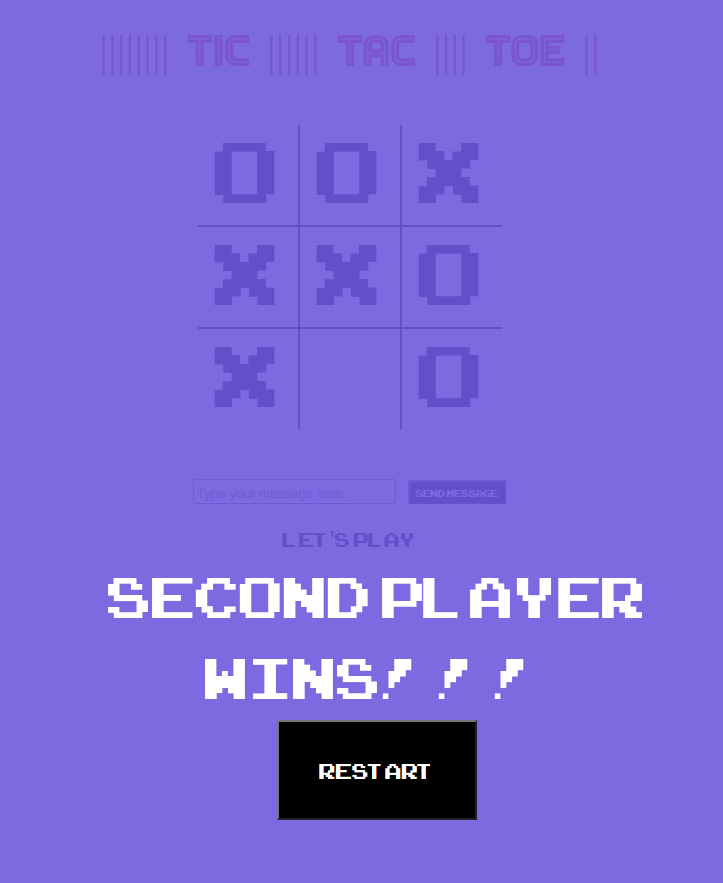

# Tic-Tac-Toe
## First GA Project:
  

  
# Dependencies:

- flask-socketio
- Flask
- socketio JavaScript Library
    - https://cdnjs.cloudflare.com/ajax/libs/socket.io/1.7.3/socket.io.min.js
   

### Installation of dependencies:
- `sudo apt-get update`
- `pip install flask-socketio`
- `pip install Flask`
  
# Gameplay

The game runs on Flask server wrapped by socketio using Python socketio library. I used an apache server to reverse proxy to the flask server and port forwarded it to the internet on [www.ga-project1.duckdns.org](http://www.ga-project1.duckdns.org/). 

At this stage server doesn't create individual rooms and broadcast each message
to all connected clients. 

When the games ends with a win or draw a restart page pops up. If one player presses
the 'Restart' button, game restarts for both parties. In addition everyone connected to 
the server can watch the game being played and send a message to the main screen.

 

  
# Future Improvements

Minor bug-fixes such as; players can overwrite each other's play. I am planning to re-write the game logic on the server side with Python to overcome this issue.

Create individual rooms and broadcast to a targeted group of players and limit each room to two players. Add a scoreboard and give the players the option to choose a character token to mark the board with instead of an "X" or "O". 

Port forward the page on port:443 with an SSL key. 
  
# What I Learned
I spent majority of my time on researching and learning how to use Flask Socketio library as well as Apache Server settings. I learned how to create individual rooms to broadcast to a targeted audience however I didn't have enough time to implement this before the presentation day.  